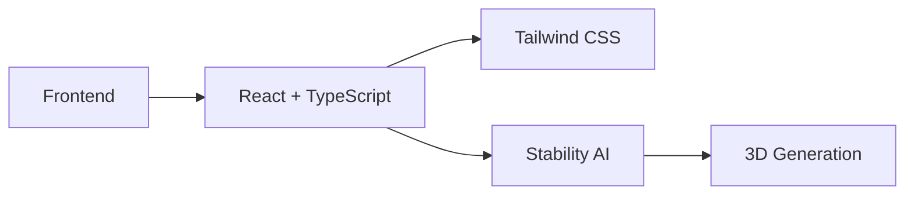

  <h1>Welcome to AlfarAI 👋</h1>
  
Transforming Ideas into Stunning 3D Reality

  
  
  

## 🎯 Our Mission

At AlfarAI, we're revolutionizing the way creators bring their ideas to life. Our AI-powered platform transforms text descriptions into stunning 3D images, making professional 3D visualization accessible to everyone.

## 🌟 What We Do

- 🎨 **AI-Powered 3D Generation**: Transform text into photorealistic 3D images
- 🚀 **Instant Results**: Generate high-quality 3D visuals in seconds
- 🎯 **Multiple Styles**: Choose from various rendering styles and qualities
- 💡 **Intuitive Interface**: User-friendly platform for creators of all skill levels

## 🛠️ Our Technology Stack

## 📊 GitHub Stats

  

## 🔥 Featured Projects

### [AlfarAI Platform](https://github.com/alfarai/alfarai)
Our flagship 3D image generation platform, powered by advanced AI technology.

## 🤝 Let's Connect

- 🌐 Visit our website: [alfarAI.com](https://alfarAI.com)
- 🐦 Follow us on Twitter: [@Alfar_AI](https://x.com/Alfar_AI)
- 📧 Contact us: [Contact Form](https://alfarAI.com/contact)

  

---

  Built with ❤️ by the AlfarAI Team

